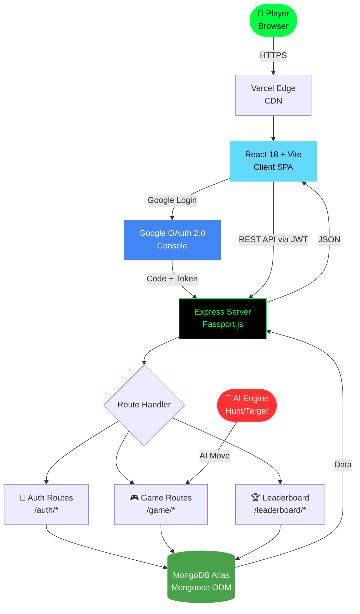

<div align="center">

```
██████╗  █████╗ ████████╗████████╗██╗     ███████╗███████╗██╗  ██╗██╗██████╗ 
██╔══██╗██╔══██╗╚══██╔══╝╚══██╔══╝██║     ██╔════╝██╔════╝██║  ██║██║██╔══██╗
██████╔╝███████║   ██║      ██║   ██║     █████╗  ███████╗███████║██║██████╔╝
██╔══██╗██╔══██║   ██║      ██║   ██║     ██╔══╝  ╚════██║██╔══██║██║██╔═══╝ 
██████╔╝██║  ██║   ██║      ██║   ███████╗███████╗███████║██║  ██║██║██║     
╚═════╝ ╚═╝  ╚═╝   ╚═╝      ╚═╝   ╚══════╝╚══════╝╚══════╝╚═╝  ╚═╝╚═╝╚═╝     
                                                                               
██╗    ██╗ █████╗ ██████╗ 
██║    ██║██╔══██╗██╔══██╗
██║ █╗ ██║███████║██████╔╝
██║███╗██║██╔══██║██╔══██╗
╚███╔███╔╝██║  ██║██║  ██║
 ╚══╝╚══╝ ╚═╝  ╚═╝╚═╝  ╚═╝
```

### ⚓ Fire. Sink. Dominate. — A full-stack naval warfare game with an AI that hunts you back.

<br/>

[](https://react.dev/)
[](https://vitejs.dev/)
[](https://expressjs.com/)
[](https://www.mongodb.com/)
[](https://developers.google.com/identity)

<br/>

[](https://jwt.io/)
[](https://www.passportjs.org/)
[](https://vercel.com/)
[](https://mongoosejs.com/)

<br/>

[](https://github.com/aarav12e/BattleShip-War/forks)
[](https://github.com/aarav12e/BattleShip-War)
[](https://github.com/aarav12e/BattleShip-War)

</div>

---

## 🎯 Mission Briefing

**BattleShip War** is a full-stack MERN implementation of the classic naval combat game — rebuilt for the modern web. Sign in with Google, place your fleet, and go head-to-head against an AI that runs a military-grade **Hunt/Target algorithm**. Every hit, every miss, every sinking ship is tracked on a global leaderboard.

> This isn't just Battleship. This is *war*.

---

## 🗺️ Theatre of Operations — System Architecture



---

## 🛳️ Fleet Manifest — Project Structure

```
BattleShip-War/                    ← Monorepo Root
│
├── 📂 client/                     ← React Frontend
│   ├── 📂 src/
│   │   ├── 📂 components/
│   │   │   ├── Grid/              # 13×14 battle grid component
│   │   │   ├── Fleet/             # Ship placement UI
│   │   │   └── Navbar/            # Navigation + auth state
│   │   │
│   │   ├── 📂 context/
│   │   │   └── AuthContext.jsx    # Global auth state (Google OAuth)
│   │   │
│   │   ├── 📂 pages/
│   │   │   ├── Login.jsx          # Google OAuth entry point
│   │   │   ├── Game.jsx           # Main game battlefield
│   │   │   ├── Leaderboard.jsx    # Global rankings table
│   │   │   ├── Profile.jsx        # Player stats + history
│   │   │   └── AuthCallback.jsx   # OAuth redirect handler
│   │   │
│   │   └── 📂 utils/
│   │       └── gameLogic.js       # Ship placement, hit detection logic
│   │
│   ├── 📄 vercel.json             # SPA routing config
│   └── 📄 package.json
│
├── 📂 server/                     ← Express Backend
│   ├── 📂 config/
│   │   └── passport.js            # Google OAuth Passport strategy
│   │
│   ├── 📂 middleware/
│   │   └── authMiddleware.js      # JWT verification middleware
│   │
│   ├── 📂 models/
│   │   ├── User.js                # Player schema (Gmail-only)
│   │   └── Game.js                # Game state + score schema
│   │
│   ├── 📂 routes/
│   │   ├── auth.js                # /auth/google, /auth/callback, /auth/me
│   │   ├── game.js                # /game/start, /game/move, /game/end
│   │   └── leaderboard.js         # /leaderboard/top, /leaderboard/me
│   │
│   ├── 📄 index.js                # Express app entry point
│   ├── 📄 vercel.json             # Serverless function config
│   └── 📄 package.json
│
├── 📄 .gitignore
└── 📄 README.md
```

---

## 🛠️ Tech Stack — Arsenal

| Layer | Technology | Role |
|-------|-----------|------|
| **Frontend** |  | Component-based game UI |
| **Build Tool** |  | Fast HMR + production bundler |
| **Routing** |  | Client-side page navigation |
| **Backend** |  | REST API server |
| **Database** |  | Cloud NoSQL game data store |
| **ODM** |  | Schema modeling + validation |
| **Auth** |  | Gmail-only social login |
| **Auth Strategy** |  | OAuth middleware for Express |
| **Sessions** | -000?logo=jsonwebtokens&logoColor=pink&style=flat-square) | Stateless token auth |
| **Fonts** | Orbitron + Share Tech Mono | Military-grade typography |
| **Deploy** |  | Both client + server on Vercel |

---

## 🗺️ Battle Grid Specs

```
  ┌───┬─A─┬─B─┬─C─┬─D─┬─E─┬─F─┬─G─┬─H─┬─I─┬─J─┬─K─┬─L─┬─M─┐
  │ 1 │   │   │   │   │   │   │   │   │   │   │   │   │   │
  │ 2 │   │   │   │   │   │   │   │   │   │   │   │   │   │
  │ 3 │   │   │   │ ■ │ ■ │ ■ │ ■ │ ■ │   │   │   │   │   │  ← Carrier (5)
  │ 4 │   │   │   │   │   │   │   │   │   │   │   │   │   │
  │ 5 │   │ ■ │ ■ │ ■ │ ■ │   │   │   │   │   │   │   │   │  ← Battleship (4)
  │ 6 │   │   │   │   │   │   │   │   │   │   │   │   │   │
  │ 7 │   │   │   │   │   │ ■ │ ■ │ ■ │   │   │   │   │   │  ← Cruiser (3)
  │ 8 │   │   │   │   │   │   │   │   │ ■ │ ■ │ ■ │   │   │  ← Submarine (3)
  │ 9 │   │   │   │   │   │   │   │   │   │   │   │   │   │
  │10 │   │   │ ■ │ ■ │   │   │   │   │   │   │   │   │   │  ← Destroyer (2)
  │11 │   │   │   │   │   │   │   │   │   │   │   │   │   │
  │12 │   │   │   │   │   │   │ ■ │ ■ │   │   │   │   │   │  ← Patrol Boat (2)
  │13 │   │   │   │   │   │   │   │   │   │   │   │   │   │
  │14 │   │   │   │   │   │   │   │   │   │   │   │   │   │
  └───┴───┴───┴───┴───┴───┴───┴───┴───┴───┴───┴───┴───┴───┘
              Columns A–M (13)  ×  Rows 1–14 (14)  =  182 cells
```

### ⚓ Fleet Registry

| Ship | Size | Symbol |
|------|------|--------|
| 🛳️ Carrier | 5 cells | `■ ■ ■ ■ ■` |
| ⚔️ Battleship | 4 cells | `■ ■ ■ ■` |
| 🚢 Cruiser | 3 cells | `■ ■ ■` |
| 🤿 Submarine | 3 cells | `■ ■ ■` |
| 🚤 Destroyer | 2 cells | `■ ■` |
| 🛥️ Patrol Boat | 2 cells | `■ ■` |

---

## 💥 Scoring System

```
  ┌─────────────────────────────────────────────────────┐
  │                  SCORING TABLE                      │
  ├─────────────────────────┬───────────────────────────┤
  │  Event                  │  Points                   │
  ├─────────────────────────┼───────────────────────────┤
  │  🎯 Direct Hit          │  + 100 pts                │
  │  💀 Ship Sunk           │  + 500 pts                │
  │  🏆 Victory             │  + 2000 pts               │
  │  💨 Miss                │  -  20 pts                │
  │  ⏱️  Every 10 seconds   │  -   5 pts                │
  │  🔄 Turns over 30       │  -  10 pts / extra turn   │
  └─────────────────────────┴───────────────────────────┘

  STRATEGY TIP: Hunt fast. Every second costs you rank.
```

---

## 🤖 AI Engine — Hunt/Target Algorithm

The enemy AI isn't random. It uses a **two-phase military strategy**:

```
  PHASE 1: HUNT MODE 🔍
  ─────────────────────────────────────────────────
  AI fires in a checkerboard pattern — covering
  exactly 50% of cells while guaranteeing it will
  hit every possible ship placement.

    . X . X . X . X . X . X .
    X . X . X . X . X . X . X
    . X . X . X . X . X . X .
    X . X . X . X . X . X . X

  PHASE 2: TARGET MODE 🎯
  ─────────────────────────────────────────────────
  After a hit → AI switches to Target Mode.
  Fires at all 4 adjacent cells (N, S, E, W).

            [N]
       [W] [HIT] [E]
            [S]

  PHASE 3: LINE EXTENSION 🏹
  ─────────────────────────────────────────────────
  After 2 hits in a line → AI locks direction and
  extends both ways until the ship is sunk.

    ← extend  [HIT][HIT]  extend →
```

> ⚠️ **Warning:** This AI will find your fleet. Deploy wisely.

---

## 🔐 Security Fortress

```
  REQUEST
     │
     ▼
  ┌─────────────────────────────┐
  │  Gmail Enforced Check       │  ← Only @gmail.com allowed
  │  (server-side validation)   │    Other providers → 403 Rejected
  └──────────────┬──────────────┘
                 │
                 ▼
  ┌─────────────────────────────┐
  │  Passport.js OAuth Strategy │  ← Google OAuth 2.0 flow
  └──────────────┬──────────────┘
                 │
                 ▼
  ┌─────────────────────────────┐
  │  JWT Token Issued           │  ← 7-day expiry, signed secret
  │  (Stateless — no sessions)  │
  └──────────────┬──────────────┘
                 │
                 ▼
  ┌─────────────────────────────┐
  │  CORS Shield                │  ← Restricted to FRONTEND_URL only
  └──────────────┬──────────────┘
                 │
                 ▼
  ✅  AUTHORIZED ACCESS
```

| Security Layer | Implementation |
|---------------|----------------|
| 🔒 Gmail-only login | `@gmail.com` enforced server-side in Passport strategy |
| 🎫 JWT Tokens | 7-day expiry, signed with `JWT_SECRET` |
| 🛡️ CORS Policy | Restricted to `FRONTEND_URL` env variable only |
| 🚫 No sessions | Fully stateless REST API — no cookie vulnerabilities |

---

## ⚙️ Environment Variables

### Server (`server/.env`)

```env
# ─── Database ──────────────────────────────────────
MONGODB_URI=mongodb+srv://<user>:<pass>@cluster.mongodb.net/battleship-war

# ─── Google OAuth ──────────────────────────────────
GOOGLE_CLIENT_ID=123456789.apps.googleusercontent.com
GOOGLE_CLIENT_SECRET=GOCSPX-xxxxxxxxxxxxxxxxxxxx

# ─── JWT ───────────────────────────────────────────
JWT_SECRET=<generate: openssl rand -hex 32>

# ─── URLs ──────────────────────────────────────────
FRONTEND_URL=https://your-client.vercel.app
BACKEND_URL=https://your-server.vercel.app
NODE_ENV=production
```

### Client (`client/.env`)

```env
# ─── API ───────────────────────────────────────────
VITE_API_URL=https://your-server.vercel.app
```

---

## 🚀 Getting Started — Deploy Your Fleet

### Prerequisites

```bash
node --version    # v18+ required
npm --version     # v9+ recommended
```

### Local Development

```bash
# Clone the repo
git clone https://github.com/aarav12e/BattleShip-War.git
cd BattleShip-War
```

**Backend:**
```bash
cd server
npm install
cp .env.example .env      # Fill in your secrets
npm run dev               # Starts at http://localhost:5000
```

**Frontend:**
```bash
cd client
npm install
cp .env.example .env      # Set VITE_API_URL=http://localhost:5000
npm run dev               # Starts at http://localhost:5173
```

---

## ☁️ Deployment Pipeline

```
  📦 Push to main
        │
        ├─────────────────────────────────────────┐
        ▼                                         ▼
  ┌──────────────┐                        ┌──────────────┐
  │ Deploy Server│                        │ Deploy Client│
  │  cd server   │                        │  cd client   │
  │  vercel --prod│                       │  vercel --prod│
  └──────┬───────┘                        └──────┬───────┘
         │                                       │
         ▼                                       ▼
  server.vercel.app                      client.vercel.app
         │                                       │
         └──────────────┬────────────────────────┘
                        ▼
              🌐 Full-Stack Live App
```

### Step-by-step Vercel Deploy

```bash
# 1. Install Vercel CLI
npm i -g vercel

# 2. Deploy the backend first
cd server
npx vercel --prod

# 3. Then deploy the frontend
cd ../client
npx vercel --prod
```

### Vercel Dashboard — Environment Variables

Set these in **Project Settings → Environment Variables**:

**Server project:**

| Key | Value |
|-----|-------|
| `MONGODB_URI` | Your Atlas connection string |
| `GOOGLE_CLIENT_ID` | From Google Cloud Console |
| `GOOGLE_CLIENT_SECRET` | From Google Cloud Console |
| `JWT_SECRET` | `openssl rand -hex 32` output |
| `FRONTEND_URL` | Your deployed client URL |
| `BACKEND_URL` | Your deployed server URL |
| `NODE_ENV` | `production` |

**Client project:**

| Key | Value |
|-----|-------|
| `VITE_API_URL` | Your deployed server URL |

### After Deploying — Update Google Console

Go to [Google Cloud Console](https://console.cloud.google.com) and add:

- **Authorized JavaScript origins:** `https://your-client.vercel.app`
- **Authorized redirect URIs:** `https://your-server.vercel.app/auth/google/callback`

---

## 🗺️ API Endpoints

> Base URL: `https://your-server.vercel.app`

### Auth Routes

| Method | Endpoint | Description |
|--------|----------|-------------|
| `GET` | `/auth/google` | Initiates Google OAuth flow |
| `GET` | `/auth/google/callback` | OAuth redirect handler |
| `GET` | `/auth/me` | Get current user (JWT required) |
| `GET` | `/auth/logout` | Logout + invalidate session |

### Game Routes

| Method | Endpoint | Description |
|--------|----------|-------------|
| `POST` | `/game/start` | Initialize new game, place AI fleet |
| `POST` | `/game/move` | Submit player's attack move |
| `GET` | `/game/:id` | Get current game state |
| `POST` | `/game/end` | Finalize game + record score |

### Leaderboard Routes

| Method | Endpoint | Description |
|--------|----------|-------------|
| `GET` | `/leaderboard/top` | Top players globally |
| `GET` | `/leaderboard/me` | Current player's personal rank |

---

## 📡 Auth Flow — Google OAuth Pipeline

```
  👤 Player clicks "Login with Google"
              │
              ▼
  🌐 GET /auth/google
              │
              ▼
  🔑 Google OAuth Consent Screen
     (Gmail-only enforced)
              │
              ▼
  📨 Google returns auth code
              │
              ▼
  ⚙️  Passport.js exchanges code → profile
              │
              ▼
  🔍 Check email ends with @gmail.com
     ├── ✅ YES → Create/find User in MongoDB
     └── ❌ NO  → 403 Forbidden
              │
              ▼
  🎫 JWT issued (7-day expiry)
              │
              ▼
  🚀 Redirect to /auth/callback?token=...
              │
              ▼
  💾 AuthContext stores token in memory
              │
              ▼
  🎮 Player enters the battlefield
```

---

## 🎮 Game Flow

```
  🏠 Login Page
      │
      ▼ Google OAuth ✅
  📋 Profile Page
  (view stats, past games)
      │
      ▼ Start Game
  🗺️  Fleet Placement Phase
  (drag & drop ships on 13×14 grid)
      │
      ▼ Ready!
  ⚔️  Battle Phase
  ┌───────────────────────────────────┐
  │  Player fires → AI responds       │
  │  Hunt/Target AI evaluates board   │
  │  Hit/Miss/Sink feedback shown     │
  │  Score updates in real-time       │
  └───────────────┬───────────────────┘
                  │ All ships sunk
                  ▼
  🏆 Victory / ☠️ Defeat Screen
      │
      ▼ Score submitted
  📊 Leaderboard Updated
```

---

## 🤝 Contributing

```bash
# Fork → Clone → Branch
git checkout -b feature/your-feature-name

# Make changes → Commit
git commit -m "feat: your description here"

# Push → Open PR
git push origin feature/your-feature-name
```

---

## 👨‍💻 Author

<div align="center">

**Aarav Kumar**
*Full-Stack Developer · MERN Stack · Ignite Club*

[](https://github.com/aarav12e)

</div>

---

<div align="center">

```
⚓  ═══════════════════════════════════════════  ⚓
       ALL SHIPS MUST SINK. ONLY ONE SURVIVES.
⚓  ═══════════════════════════════════════════  ⚓
```

*Built with 💥 — MERN Stack · Google OAuth · Hunt/Target AI*

**`< / aarav12e >`**

</div>
